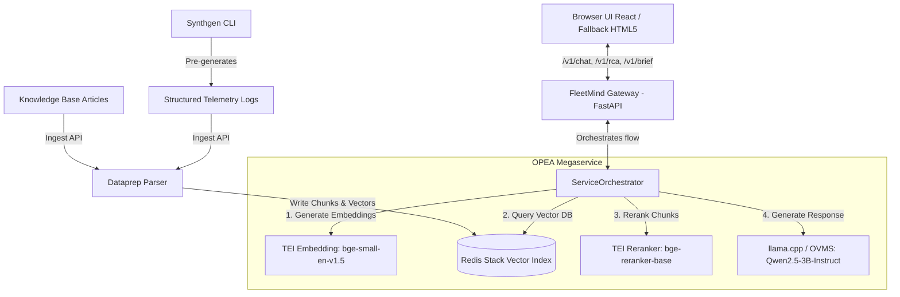

# FleetMind — OPEA GenAI NetOps Copilot

[](https://opensource.org/licenses/Apache-2.0)
[](https://github.com/brytesika-AI/Kaggle-Competions/actions)
[](https://opea.dev)

FleetMind is a generative AI network-operations copilot for emerging-market telecom and pay-TV operators, built on the Intel-backed **OPEA (Open Platform for Enterprise AI)** framework. By combining statistical anomaly clustering with a retrieval-grounded (RAG) knowledge base, it lets engineers converse over telemetry logs, generate schema-validated root-cause-analysis drafts, and compose jargon-free executive briefs. Engineered for CPU-only commodity hardware, FleetMind delivers enterprise-grade GenAI capability without the cost or complexity of high-end GPUs.

---

## 1. Architecture



---

## 2. Quickstart (3 Commands Max)

Deploy and start FleetMind on any clean Ubuntu machine with only Docker + Docker Compose installed:

```bash
# 1. Clone the repository and enter the directory
git clone https://github.com/brytesika-AI/Kaggle-Competions.git && cd "Kaggle-Competions/Telco Vertical"

# 2. Deploy the stack (performs preflight, downloads 1.9GB model, builds and starts services)
bash deploy.sh

# 3. (Optional) Run the scripted CLI demonstration walkthrough of all flows
bash scripts/demo.sh
```

---

## 3. Hardware & Software Requirements

- **Operating System**: Ubuntu 22.04 LTS / 24.04 LTS (highly recommended; Windows/macOS supported via Docker Desktop).
- **CPU**: 4-core CPU (AVX-2/AVX-512 support recommended for Intel optimization).
- **RAM**: 8GB RAM minimum (32GB/64GB recommended).
- **Disk Space**: 10GB free space (for Docker images and model file storage).
- **Expected Install Time**: **< 5 minutes** on a standard 100 Mbps internet connection (the LLM model file download is ~1.9GB; TEI images and Redis images total ~2.5GB).

---

## 4. Operational Flows

FleetMind provides three core workflows designed for NetOps triage:
1. **Fleet Q&A**: Operations engineers query telemetry logs and hardware troubleshooting manuals in natural language, receiving citation-grounded, peer-reviewed answers.
2. **RCA Draft**: Engineers select an incident window, triggering statistical anomaly clustering over logs and matching KB articles. The LLM generates a structured, schema-validated JSON Root Cause Analysis draft.
3. **Executive Brief**: Transforms complex technical RCA reports into plain-English, jargon-free briefings of under 300 words for non-technical leadership, quantifying device impact.

---

## 5. Lite Mode (Resource-Constrained Environments)

For machines with low RAM (< 16GB) or weak CPUs, launch the system in **Lite Mode**, which disables the TEI reranker service and reduces the LLM context window:

```bash
# Shut down default services
docker compose down

# Launch Lite Mode
docker compose --profile lite up -d
```

---

## 6. Third-Party Components & Licenses

FleetMind strictly adheres to the Apache 2.0 license compatibility requirements. **Zero GPL, LGPL, or AGPL dependencies are used.**

| Component Name | License | Purpose |
|---|---|---|
| **Redis Stack** | SSPL / RSALv2 | High-performance vector database and search index |
| **HuggingFace TEI** | Apache 2.0 | High-throughput Text Embeddings Inference server |
| **llama.cpp** | MIT | Lightweight, CPU-optimized GGUF LLM inference serving |
| **Qwen2.5-3B-Instruct** | Apache 2.0 | Core generative LLM |
| **bge-small-en-v1.5** | Apache 2.0 | Semantic embeddings generator model |
| **bge-reranker-base** | Apache 2.0 | Semantic document reranker model |
| **FastAPI** | MIT | Gateway web API framework |
| **pandas / numpy** | BSD 3-Clause | Log parsing and statistical grouping |
| **jsonschema** | MIT | Validates LLM output structures |

---

## 7. Attribution
This project is built using Open Source components from the [OPEA Project](https://github.com/opea-project), specifically adopting microservice and megaservice orchestrator patterns from the [GenAIComps](https://github.com/opea-project/GenAIComps) and [GenAIExamples](https://github.com/opea-project/GenAIExamples) repositories.
